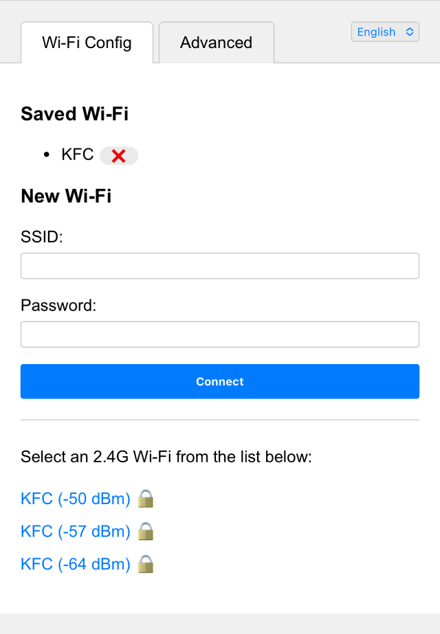
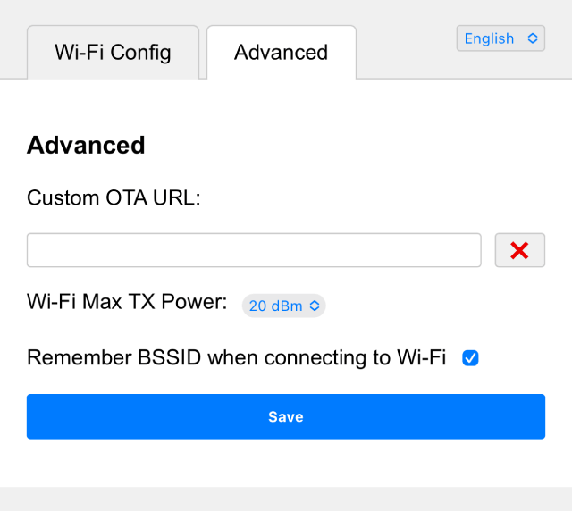

# Komponen Koneksi Wi-Fi ESP32

Komponen ini menangani koneksi Wi-Fi untuk perangkat. Alurnya dimulai dengan
mencoba tersambung menggunakan kredensial yang sudah tersimpan di flash. Jika
gagal, komponen akan membuat titik akses dan peladen web agar pengguna dapat
memasukkan kredensial Wi-Fi baru.

Alamat web konfigurasi adalah `http://192.168.4.1`.

## Tampilan Konfigurasi Wi-Fi



## Tampilan Opsi Lanjutan



## Perubahan Versi 3.1.0

- Callback event sekarang memiliki parameter `data` tambahan.
- Event terputus sekarang membawa kode alasan putus koneksi melalui parameter `data`.
- Aplikasi dapat membedakan skenario putus koneksi dengan lebih tepat.

## Perubahan Versi 3.0.0

- Menambahkan kelas `WifiManager` untuk manajemen koneksi Wi-Fi terpadu.
- Memperbaiki `DnsServer` dan `WifiConfigurationAp` agar pengelolaan resource lebih aman.
- Memperbarui HTML pesan sukses konfigurasi agar memakai endpoint keluar, bukan reboot.
- Memperkuat penanganan error dan pengelolaan state di `WifiStation`.
- Membersihkan kode yang tidak terpakai dan meningkatkan keamanan utas komponen.

## Perubahan Versi 2.6.0

- Menambahkan dukungan mode 5G pada ESP32C5.

## Perubahan Versi 2.4.0

- Menambahkan bahasa Jepang dan Tionghoa Tradisional.
- Menambahkan tab pengaturan lanjutan.
- Menambahkan header `"Connection: close"` untuk mengurangi socket yang tertinggal.

## Perubahan Versi 2.3.0

- Menambahkan dukungan pemilihan bahasa dari permintaan web.

## Perubahan Versi 2.2.0

- Menambahkan dukungan ESP32 SmartConfig (ESPTouch v2).

## Perubahan Versi 2.1.0

- Memperbaiki logika koneksi Wi-Fi.

## Perubahan Versi 2.0.0

- Menambahkan dukungan banyak SSID Wi-Fi.
- Memilih jaringan terbaik secara otomatis.
- Menambahkan portal tangkapan untuk konfigurasi Wi-Fi.
- Menambahkan dukungan banyak bahasa pada antarmuka web.

## Konfigurasi

Kredensial Wi-Fi disimpan di flash pada namespace `"wifi"`.

Kunci yang dipakai adalah `"ssid"`, `"ssid1"` sampai `"ssid9"`, lalu
`"password"`, `"password1"` sampai `"password9"`.

## Contoh Pemakaian

```cpp
#include <wifi_manager.h>
#include <ssid_manager.h>

// Inisialisasi event loop bawaan.
ESP_ERROR_CHECK(esp_event_loop_create_default());

// Inisialisasi NVS untuk konfigurasi Wi-Fi.
esp_err_t ret = nvs_flash_init();
if (ret == ESP_ERR_NVS_NO_FREE_PAGES || ret == ESP_ERR_NVS_NEW_VERSION_FOUND) {
    ESP_ERROR_CHECK(nvs_flash_erase());
    ret = nvs_flash_init();
}
ESP_ERROR_CHECK(ret);

// Ambil singleton WifiManager.
auto& wifi_manager = WifiManager::GetInstance();

// Inisialisasi konfigurasi dasar.
WifiManagerConfig config;
config.ssid_prefix = "ESP32";  // Awalan SSID saat mode AP.
config.language = "zh-CN";     // Bahasa antarmuka web.
wifi_manager.Initialize(config);

// Atur fungsi panggil balik untuk menangani kejadian Wi-Fi.
// Fungsi panggil balik menerima jenis kejadian dan data tambahan, misalnya alasan terputus.
wifi_manager.SetEventCallback([](WifiEvent event, const std::string& data) {
    switch (event) {
        case WifiEvent::Scanning:
            ESP_LOGI("WiFi", "Sedang memindai jaringan...");
            break;
        case WifiEvent::Connecting:
            ESP_LOGI("WiFi", "Sedang mencoba terhubung...");
            break;
        case WifiEvent::Connected:
            ESP_LOGI("WiFi", "Berhasil terhubung.");
            break;
        case WifiEvent::Disconnected:
            // data berisi kode alasan putus koneksi.
            ESP_LOGW("WiFi", "Koneksi terputus, alasan: %s", data.c_str());
            break;
        case WifiEvent::ConfigModeEnter:
            ESP_LOGI("WiFi", "Masuk ke mode konfigurasi.");
            break;
        case WifiEvent::ConfigModeExit:
            ESP_LOGI("WiFi", "Keluar dari mode konfigurasi.");
            break;
    }
});

// Cek apakah sudah ada kredensial Wi-Fi yang tersimpan.
auto& ssid_list = SsidManager::GetInstance().GetSsidList();
if (ssid_list.empty()) {
    // Jika belum ada, jalankan mode konfigurasi titik akses.
    wifi_manager.StartConfigAp();
} else {
    // Jika sudah ada, coba sambungkan ke Wi-Fi yang tersimpan.
    wifi_manager.StartStation();
}
```

Contoh penggunaan lain bisa dilihat di repositori utama:
https://github.com/78/xiaozhi-esp32
