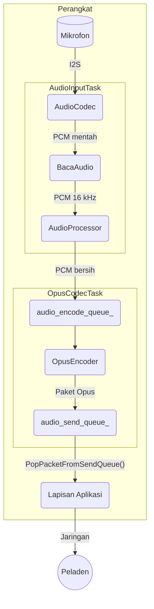
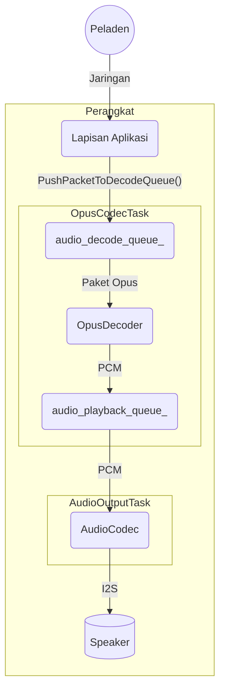

# Arsitektur Layanan Audio

Layanan audio adalah komponen inti yang mengelola seluruh alur audio pada perangkat. Tugasnya mencakup membaca suara dari mikrofon, memproses sinyal, melakukan enkode dan dekode, lalu memutar audio ke speaker. Rancangannya dibuat modular dan efisien, dengan beberapa task FreeRTOS terpisah agar respons tetap cepat.

## Komponen Utama

- `AudioService`: pengendali utama yang menyiapkan komponen audio lain, task, dan antrean data.
- `AudioCodec`: lapisan abstraksi perangkat keras untuk codec audio fisik. Komponen ini menangani komunikasi I2S mentah untuk masukan dan keluaran audio.
- `AudioProcessor`: pemroses audio waktu nyata untuk aliran mikrofon. Umumnya mencakup peredam gema akustik, peredam bising, dan deteksi aktivitas suara. Implementasi bawaan adalah `AfeAudioProcessor`.
- `WakeWord`: pendeteksi kata bangun dari aliran audio. Komponen ini berjalan terpisah sebelum perangkat masuk ke alur percakapan utama.
- `OpusEncoderWrapper` dan `OpusDecoderWrapper`: pengelola konversi audio PCM ke format Opus dan sebaliknya. Opus dipakai karena hemat bandwidth dan latensinya rendah.
- `OpusResampler`: utilitas untuk mengubah laju sampel audio bila perangkat keras dan pipeline membutuhkan frekuensi yang berbeda.

## Model Task

Layanan ini memakai tiga task utama agar setiap tahap pipeline audio dapat berjalan paralel:

1. `AudioInputTask`
   Membaca data PCM mentah dari `AudioCodec`, lalu meneruskannya ke mesin kata bangun atau ke pemroses audio sesuai status perangkat saat itu.
2. `AudioOutputTask`
   Mengambil data PCM hasil dekode dari `audio_playback_queue_`, lalu mengirimkannya ke `AudioCodec` agar diputar di speaker.
3. `OpusCodecTask`
   Menangani proses enkode dan dekode. Task ini membaca PCM dari `audio_encode_queue_` untuk diubah menjadi paket Opus, lalu juga membaca paket Opus dari `audio_decode_queue_` untuk dikembalikan menjadi PCM.

## Alur Data

Ada dua alur utama: audio masuk dari mikrofon dan audio keluar ke speaker.

### 1. Alur Audio Masuk

Alur ini menangkap audio dari mikrofon, memprosesnya, mengubahnya ke Opus, lalu menyiapkannya untuk dikirim ke peladen.

Ringkasnya:

- `AudioInputTask` membaca PCM mentah dari `AudioCodec`.
- Data tersebut diproses oleh `AudioProcessor`.
- Hasil PCM yang sudah dibersihkan dimasukkan ke `audio_encode_queue_`.
- `OpusCodecTask` mengambil PCM itu, mengubahnya menjadi Opus, lalu menaruh hasilnya ke `audio_send_queue_`.
- Lapisan aplikasi mengambil paket Opus dari antrean tersebut untuk dikirim ke jaringan.

### 2. Alur Audio Keluar

Alur ini menerima paket audio terenkode, mengubahnya kembali menjadi PCM, lalu memutarnya melalui speaker.

Ringkasnya:

- Lapisan aplikasi menerima paket Opus dari jaringan.
- Paket itu dimasukkan ke `audio_decode_queue_`.
- `OpusCodecTask` mengambil paket tadi, mengubahnya menjadi PCM, lalu memasukkannya ke `audio_playback_queue_`.
- `AudioOutputTask` mengambil PCM tersebut dan mengirimkannya ke `AudioCodec` untuk diputar.

## Manajemen Daya

Untuk menghemat energi, kanal masukan dan keluaran pada codec audio dapat dimatikan otomatis setelah periode tidak aktif tertentu, yaitu `AUDIO_POWER_TIMEOUT_MS`. Sebuah pengatur waktu (`audio_power_timer_`) memeriksa aktivitas secara berkala dan mengatur status daya audio. Saat ada audio baru yang perlu direkam atau diputar, kanal akan diaktifkan kembali secara otomatis.
